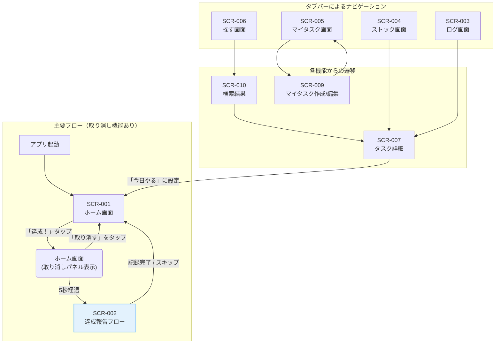

# OneNew アプリケーション総合仕様書 for Claude Code

## 1. アプリケーションのコアコンセプト

### 1.1. 哲学: 「My Palette（マイパレット）」
日常というキャンバスに、「いつもと違う行動」という新しい絵の具を一つずつ足していくことで、自分だけの色鮮やかな毎日を描き上げていく。本アプリは、そのための「パレット」となることを目指します。

### 1.2. デザインの柱
- **心地よさ (Comfortable):** 操作に迷わず、触れているだけで心地よいと感じるインターフェース。
- **発見の喜び (Discovery):** 新しいタスクとの出会いが、日々の小さなサプライズになる演出。
- **達成感の可視化 (Visualization):** 小さな成功体験が積み重なっていく様子を視覚的に実感できる設計。
- **安心感 (Secure):** ユーザーが自分のペースで、安心して使い続けられるプライバシーへの配慮。

### 1.3. 開発上の基本原則
このドキュメントはアプリケーションの仕様を定義しますが、その実装においては以下の原則に従います。

- **バージョン管理 (Git):**
  - すべてのコード変更は、意味のある単位でGitにコミットし、変更履歴を追跡可能にします。コミットメッセージは、変更内容が簡潔にわかるように記述します。

- **設計思想 (SOLID原則):**
  - 将来の機能追加や仕様変更に柔軟かつ迅速に対応できるよう、SOLID原則に基づいた拡張性の高い設計を心がけます。これにより、メンテナンスしやすく、堅牢なアプリケーションを構築します。

---

## 2. 共通デザインシステム

### 2.1. カラーパレット
| 用途 | カラー名 | カラーコード | 説明 |
| :--- | :--- | :--- | :--- |
| Primary | Primary Green | `#26A69A` | 主要ボタン、アクティブなアイコンなど |
| Accent | Accent Orange | `#FF7043` | FAB、特別なアクション、祝福の演出など |
| Background | White | `#FFFFFF` | アプリケーションの基本背景色 |
| Surface | Off White | `#F5F5F5` | カードや入力フィールドの背景色 |
| Text (Primary) | Dark Grey | `#212121` | 主要なテキスト、見出し |
| Text (Secondary)| Grey | `#757575` | 補足情報、非アクティブなテキスト |
| Border | Light Grey | `#E0E0E0` | カードの境界線、区切り線 |
| System (Success)| Success Green | `#4CAF50` | 成功メッセージ、取り消しパネルの背景 |
| System (Error) | Error Red | `#D32F2F` | エラーメッセージ |

### 2.2. タイポグラフィ (Material 3準拠)
| スタイル名 | フォントウェイト | サイズ (sp) | 用途 |
| :--- | :--- | :--- | :--- |
| headlineLarge | Regular | 32 | 画面タイトル（大）、祝福メッセージ |
| titleLarge | Regular | 22 | カードのタイトル、ダイアログのタイトル |
| bodyLarge | Regular | 16 | 主要な本文テキスト |
| bodyMedium | Regular | 14 | 補足的なテキスト、説明文 |
| labelLarge | Medium | 14 | ボタン内のテキスト |

---

## 3. 情報アーキテクチャと画面遷移

### 3.1. 基本構造
主要5機能へのアクセスを容易にするため、ボトムナビゲーションバー（タブバー）を設置します。

**タブ構成 (左から順に):**
1.  **ホーム (Home)** - `icon: Icons.home`
2.  **探す (Explore)** - `icon: Icons.search`
3.  **ストック (Stock)** - `icon: Icons.inventory_2_outlined`
4.  **ログ (Log)** - `icon: Icons.edit_calendar_outlined`
5.  **マイタスク (My Tasks)** - `icon: Icons.person_outline`

### 3.2. 画面遷移図 (Mermaid)

---

## 4. 各画面詳細設計

### [SCR-001] ホーム画面
- **目的:** ユーザーに「今日のタスク」を提案し、行動を促す。
- **レイアウト & コンポーネント:**
    - **AppBar:**
        - `title`: `Text` - "8月18日" のように現在の日付を表示。
        - `actions`: `IconButton` - `Icons.settings`。タップで設定画面へ遷移。
    - **TaskCard (中央配置):**
        - `Card`ウィジェット。背景色: `Surface`。
        - `Text (titleLarge)`: タスクタイトル (例: 「いつもと違う道で散歩する」)
        - `Wrap` of `Chip`: カテゴリタグ (例: `#リフレッシュ`, `#5分でできる`)
        - `Row`:
            - `Icon (Icons.people_alt_outlined)`
            - `Text (bodyMedium)`: 統計情報 (例: "全ユーザーの28%が達成")
    - **アクションエリア (TaskCardの下):**
        - `ElevatedButton`: ラベル「達成！」, スタイル: `Primary`
        - `OutlinedButton`: ラベル「あとでやる」
        - `TextButton`: ラベル「他の提案を見る」
    - **取り消しパネル (UndoPanel) - 初期状態:非表示:**
        - `Container`: 背景色: `System (Success)`
        - `Row`:
            - `Icon (Icons.check_circle)`
            - `Text`: 「🎉達成しました！」
            - `Spacer`
            - `TextButton`: ラベル「取り消す」
- **ユーザーインタラクション & ロジック:**
    - **画面表示時:**
        - API Call: `GET /tasks/daily` をコールし、今日のタスクを取得。
        - **状態:**
            - **ロード中:** `TaskCard`の位置に`CircularProgressIndicator`を表示。
            - **成功:** 取得したタスク情報を`TaskCard`に表示。
            - **エラー:** エラーメッセージとリトライボタンを表示。
        - **オンボーディング:** ユーザーの利用日数が3日未満の場合、APIリクエスト時に`onboarding=true`パラメータを付与し、入門用タスクを要求する。
    - **「達成！」ボタンタップ時:**
        - `TaskCard`とアクションエリアを非表示にする。
        - `UndoPanel`を画面下部にアニメーション付きで表示する。
        - 5秒間のタイマーを開始する。
    - **「取り消す」ボタンタップ時 (UndoPanel内):**
        - タイマーをキャンセルする。
        - `UndoPanel`を非表示にする。
        - `TaskCard`とアクションエリアを再表示する。
    - **5秒経過時 (タイマー完了):**
        - `UndoPanel`を非表示にする。
        - [SCR-002] 達成報告画面をモーダルで表示する。
    - **「他の提案を見る」タップ / カードの左右スワイプ時:**
        - API Call: `GET /tasks/daily?force_refresh=true` をコールし、別のタスクを取得。
        - カードが回転またはスライドアウトし、新しいカードがフェードインするアニメーションを実行する。
    - **「あとでやる」タップ時:**
        - API Call: `POST /stock` に現在のタスクIDを送信。
        - 成功後、`SnackBar`で「ストックに追加しました」と表示し、自動で次のタスクを提案する。

### [SCR-002] 達成報告フロー
- **目的:** タスク完了報告と、それに伴う感情やメモを手軽に記録する。
- **形式:** モーダルダイアログ (`showModalBottomSheet` または `showGeneralDialog`)
- **レイアウト & コンポーネント:**
    - **ステップ1: 報告**
        - `Text (headlineLarge)`: 「お疲れ様でした！」
        - `TextField`: 複数行入力可。ヒントテキスト: 「感想や気づきをメモしよう（任意）」
        - `OutlinedButton`: アイコン`Icons.add_a_photo`付き。ラベル「写真を追加（任意）」
        - `ElevatedButton`: ラベル「気持ちを記録する」
        - `TextButton`: ラベル「スキップして完了」
    - **ステップ2: フィール・ログ (ステップ1のボタンタップで表示切替)**
        - `Text (titleLarge)`: 「どんな気持ちでしたか？」
        - `Wrap` of `ChoiceChip`: 感情を表す絵文字（😄, 😊, 🎉, 🤔, ✨）とテキストのチップ。選択状態が明確にわかるUI。
        - `ElevatedButton`: ラベル「記録して完了」
- **ユーザーインタラクション & ロジック:**
    - **「気持ちを記録する」タップ時:** 画面の内容をステップ2に切り替える。
    - **「スキップして完了」タップ時:**
        - API Call: `POST /logs` をコール。リクエストボディにタスクID、メモ、写真URL（あれば）を含める。
        - 成功後、モーダルを閉じる。
    - **「記録して完了」タップ時:**
        - API Call: `POST /logs` をコール。リクエストボディにタスクID、メモ、写真URL、選択した感情を含める。
        - 成功時: `confetti`パッケージ等を利用した祝福アニメーションを表示し、その後モーダルを閉じる。
    - **状態:** API通信中はボタンをローディング状態にする。

### [SCR-003] ログ画面
- **目的:** 過去の達成履歴を振り返り、自己肯定感を高める。
- **レイアウト & コンポーネント:**
    - **AppBar:** `title`: `Text("ログ")`
    - **SummaryPanel:** 合計達成数、最長連続記録などを表示。
    - **TableCalendar:**
        - タスク達成日に`DotIndicator`を表示。
        - 選択された日付はハイライトされる。
    - **ListView:**
        - カレンダーで選択された日付の達成タスクリストを表示。
        - `ListTile`: タスク名、記録した感情の絵文字、メモ/写真の有無を示すアイコンを表示。
- **ユーザーインタラクション & ロジック:**
    - **画面表示時:** API Call: `GET /logs?month={current_month}` をコールし、当月の達成履歴を取得。
    - **カレンダーの日付タップ時:** 画面下部の`ListView`の内容を、選択された日付のデータに更新する。
    - **`ListTile`タップ時:** 達成内容の詳細（メモ全文や写真）を閲覧できる詳細画面[SCR-007]へ遷移。

### [SCR-004] ストック画面
- **目的:** 「あとでやる」タスクを管理し、未来の行動に繋げる。
- **レイアウト & コンポーネント:**
    - **AppBar:** `title`: `Text("ストック")`
    - **StockActivationPanel (リスト最上部):** `OutlinedButton`: ラベル「ストックからランダムに提案」
    - **ListView:**
        - `ListTile`: タスク名、カテゴリタグを表示。
        - `trailing`: `TextButton` ラベル「今日やる」
- **ユーザーインタラクション & ロジック:**
    - **「今日やる」タップ時:**
        - 確認ダイアログを表示: 「今日のタスクをこれに変更しますか？」
        - API Call: `POST /tasks/daily/replace` をコール。
        - 成功後、ホームタブに切り替え、画面を更新する。
    - **スワイプによる削除:**
        - `ListTile`を左右にスワイプすると、`Dismissible`ウィジェットで削除。
        - API Call: `DELETE /stock/{id}` をコール。
        - `SnackBar`で「削除しました」と「元に戻す」アクションを表示。

### [SCR-005] マイタスク画面
- **目的:** ユーザーが作成したプライベートなタスクを管理する。
- **レイアウト & コンポーネント:**
    - **AppBar:** `title`: `Text("マイタスク")`
    - **ListView:** ユーザーが作成したタスクのリスト。
    - **FloatingActionButton (FAB):** `icon: Icons.add`。タップで[SCR-009]へ遷移。
- **プライバシー:** ここで作成されたタスクは完全にプライベートであり、他ユーザーとの共有や提案ロジックには一切含まれない。

### [SCR-006] 探す画面
- **目的:** ユーザーが能動的に新しいタスクを発見する。
- **レイアウト & コンポーネント:**
    - **AppBar:** `title`: `Text("探す")`
    - **SearchBar:** `TextField`に検索アイコン付き。
    - **CategoryGrid:** カテゴリ（#リフレッシュ, #クリエイティブ 等）をグリッド表示。
- **ユーザーインタラクション & ロジック:**
    - **検索実行/カテゴリタップ時:** [SCR-010] 検索結果画面へ遷移。

---

## 5. バックエンドAPI仕様

### `/tasks`
- **`GET /tasks/daily`**
    - **説明:** 今日の提案タスクを1件取得する。
    - **クエリパラメータ:** `force_refresh` (boolean, optional), `onboarding` (boolean, optional)
    - **成功レスポンス (200 OK):** `{"id": "task-123", "title": "...", "tags": ["..."], "stats": {"completion_rate": 0.28}}`
- **`POST /tasks/daily/replace`**
    - **説明:** 今日のタスクをストックやマイタスクから選択したものに置き換える。
    - **リクエストボディ:** `{"new_task_id": "task-456", "source": "stock"}`
    - **成功レスポンス (200 OK):** 上記`GET /tasks/daily`と同様のタスクオブジェクト。

### `/challenges`
- **`GET /challenges/search`**
    - **説明:** キーワードまたはカテゴリIDに基づいてタスクを検索する。
    - **クエリパラメータ:** `q` (string, optional), `category_id` (integer, optional)
    - **成功レスポンス (200 OK):** `[{"id": "task-123", "title": "...", "tags": ["..."], "is_completed": false}, ...]`

### `/logs`
- **`POST /logs`**
    - **説明:** タスクの達成を記録する。
    - **リクエストボディ:** `{"task_id": "task-123", "memo": "...", "photo_url": "...", "feeling": "😄"}`
    - **成功レスポンス (201 Created):** `{"log_id": "log-abc", "message": "Successfully created."}`
- **`GET /logs`**
    - **説明:** 指定した期間の達成ログを取得する。
    - **クエリパラメータ:** `month` (YYYY-MM)
    - **成功レスポンス (200 OK):** `{"2025-08-18": [{"id": "log-abc", ...}], "2025-08-20": [...]}`

### `/stock`
- **`GET /stock`**
    - **説明:** ストックしたタスクのリストを取得する。
    - **成功レスポンス (200 OK):** `[{"id": "task-456", ...}, ...]`
- **`POST /stock`**
    - **説明:** タスクをストックに追加する。
    - **リクエストボディ:** `{"task_id": "task-789"}`
    - **成功レスポンス (201 Created):** `{"stock_id": "stock-xyz", ...}`
- **`DELETE /stock/by-challenge/{challenge_id}`**
    - **説明:** チャレンジIDを指定して、ストックからタスクを削除する。
    - **成功レスポンス (204 No Content):**